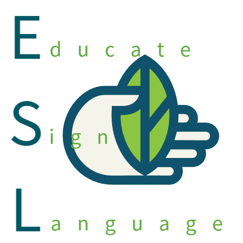
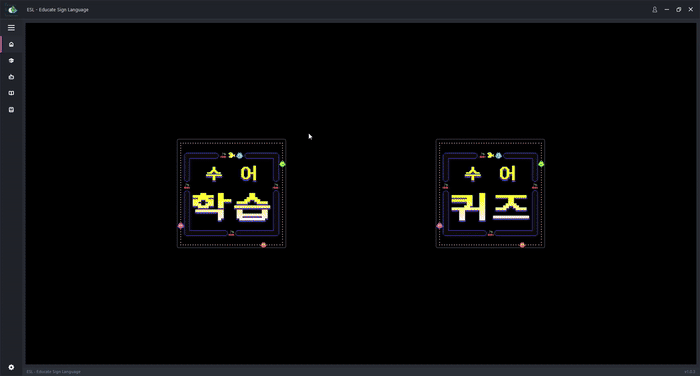
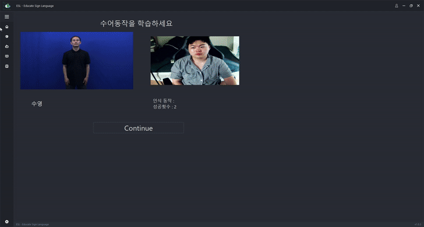
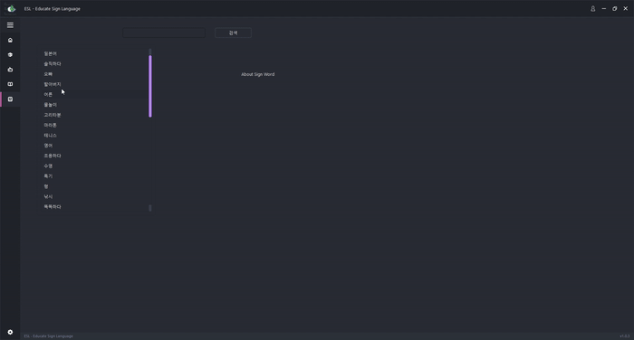

<p align="center">
  
</p>

<h1 align="center">ESL - Educate Sign Language</h1>

<p align="center">
  MediaPipe와 딥러닝(LSTM)으로 웹캠 속 손동작을 인식해 한국 수어를 학습·퀴즈로 익히는 데스크톱 앱
</p>

## 데모

### 학습 모드



### 퀴즈 모드



### 수어 사전



## 소개

ESL(Educate Sign Language)은 웹캠으로 사용자의 손동작을 실시간으로 인식하여 한국 수어(KSL) 학습을 돕는 PySide6 기반 데스크톱 애플리케이션입니다. MediaPipe로 손 랜드마크(관절 좌표)를 추출하고, 이를 시퀀스로 모아 LSTM 기반 분류 모델에 입력해 어떤 수어 단어를 표현했는지 인식합니다.

## 주요 기능

- **수어 사전**: 카테고리별 수어 단어 영상을 검색·재생하며 학습
- **학습 모드**: 카테고리(취미, 성격, 가족, 출생지, 나이, 언어 등)별 수어 영상을 따라 하면 웹캠이 동작을 인식해 정답 여부를 판별
- **퀴즈 모드**: "내 취미는 (물놀이)이며, 성격은 (긍정적), 가족은 (형)이 있습니다"처럼 문장을 랜덤 구성하고, 웹캠으로 사용자의 수어 동작을 순서대로 인식해 문장을 완성

## 기술 스택

| 영역 | 기술 |
|---|---|
| GUI | PySide6 (Qt6) |
| 손 랜드마크 추출 | MediaPipe (Hands solution) |
| 동작 인식 모델 | TensorFlow / Keras (Conv1D + LSTM) |
| 영상 처리 | OpenCV |
| 한글 텍스트 오버레이 | Pillow |

## 실행 방법

### 1. 가상환경 생성 및 패키지 설치

```powershell
python -m venv .venv
.venv\Scripts\pip install -r requirements.txt
```

> 이 저장소는 오래된 코드라 최신 mediapipe/tensorflow와 버전 충돌이 있습니다. `requirements.txt`에 검증된 버전이 고정되어 있으니 그대로 설치하면 됩니다. (자세한 내용은 `requirements.txt` 상단 주석 참고)

### 2. 앱 실행

`ESL` 폴더 안에서 실행해야 합니다(상대 경로 리소스를 사용하기 때문입니다).

```powershell
cd ESL
..\.venv\Scripts\python.exe main.py
```

웹캠을 사용하는 학습/퀴즈 기능을 쓰려면 카메라 접근 권한이 필요합니다.

## 프로젝트 구조

```
ESL/
├── main.py                # 앱 엔트리포인트 (메인 윈도우)
├── dictionary.py          # 수어 사전 화면 로직
├── quiz.py                # 퀴즈 게임 로직 (hobby → character → family)
├── quiz_cam_thread.py      # 퀴즈용 웹캠 스레드 (MediaPipe + LSTM 추론)
├── web_cam_thread.py       # 학습 모드 웹캠 스레드 (MediaPipe + LSTM 추론)
├── video_thread.py         # 수어 시범 영상 재생 스레드
├── models/                # 학습된 Keras 모델 (.h5)
├── videos/                 # 수어 단어별 시범 영상
├── modules/, widgets/      # PyDracula 기반 GUI 프레임(사이드바, 타이틀바 등)
└── userManagement/         # Firebase(pyrebase) 기반 로그인 (main.py 실행 경로에는 미포함)
demo/
├── demo_learning.gif        # 학습 모드 데모
├── demo_quiz.gif            # 퀴즈 모드 데모
└── demo_dictionary.gif      # 수어 사전 데모
```

## 라이선스 / 크레딧

GUI 프레임은 [PyDracula](https://github.com/Wanderson-Magalhaes/Simple_PySide_Base) (Wanderson M. Pimenta) 템플릿을 기반으로 합니다.
